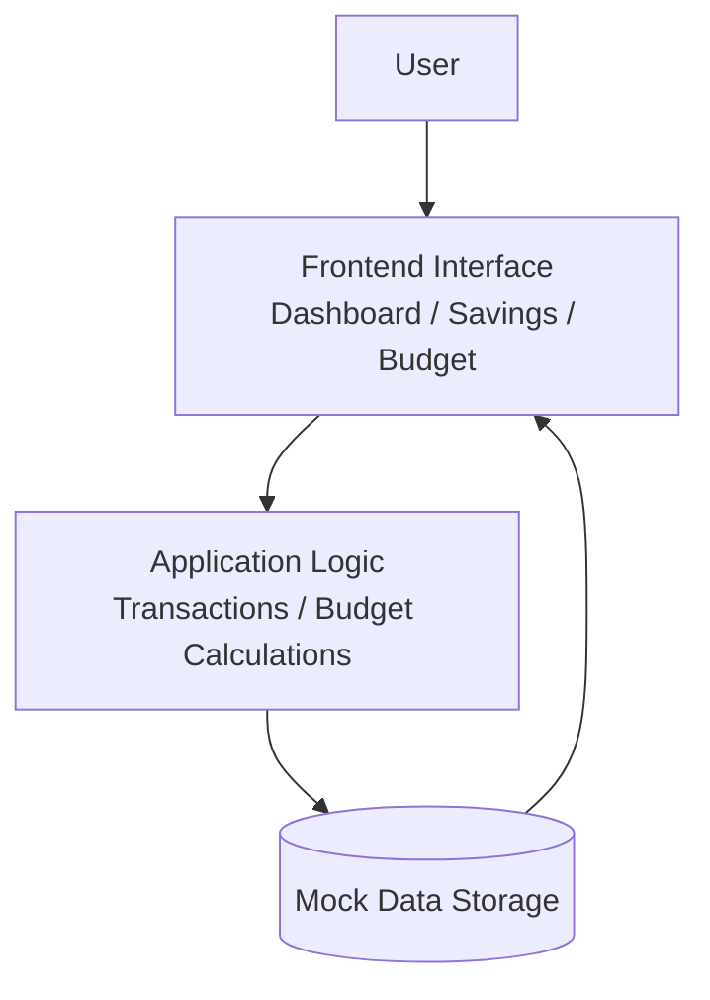

# 💰 Penny Smart
## Personal Finance Management Product

Penny Smart is a **personal finance management application** designed to help individuals track spending, manage budgets, and build consistent savings habits.

This repository contains the **product documentation, research insights, design resources, prototype, and build evidence** developed for the Penny Smart application as part of our **Product Management Capstone Project**.

---

# 📌 Product Overview

Managing personal finances can be challenging due to limited visibility into spending habits, poor budgeting practices, and difficulty maintaining savings goals.

**Penny Smart** provides users with a simple platform to:

- Track income and expenses
- Monitor spending behavior
- Set and manage savings goals
- Create budget categories
- View financial summaries

The product focuses on **simplicity, accessibility, and financial awareness** to help users build healthier financial habits.

---

# ❗ Problem Statement

Many individuals struggle to manage their finances effectively due to:

- Poor visibility into daily spending
- Lack of structured budgeting tools
- Difficulty tracking savings progress
- Financial applications that are too complex

There is a need for a **simple and intuitive financial management solution** that enables users to monitor their financial behavior and improve financial discipline.

---

# 💡 Proposed Solution

Penny Smart addresses these challenges by providing a **clean, intuitive, and user-friendly financial management platform**.

Users can:

- Track transactions easily
- Monitor spending patterns
- Manage savings goals
- Set budget limits
- View financial insights in real time

The goal is to **simplify personal finance management and encourage smarter financial decisions**.

---

# 🎯 Target Users

### Students
Students who need a simple way to manage limited income and track daily expenses.

### Young Professionals
Individuals who want to track salaries, manage spending, and build savings habits.

### Budget-Conscious Individuals
People who want better visibility into their financial activities.

---

# ✨ Key Product Features

## 📊 Dashboard
Provides a central overview of financial activity including:

- Wallet balance
- Weekly spending trends
- Budget summaries
- Savings progress
- Recent transactions

---

## 💰 Savings Goals

Users can:

- Create savings goals
- Set target amounts
- Track savings progress
- Add or withdraw funds

---

## 📊 Budget Management

Allows users to:

- Create spending categories
- Allocate budget limits
- Track spending against budgets

---

## 💳 Transaction Tracking

Users can:

- Record income and expenses
- Categorize transactions
- View transaction history

---

# 🎨 Product Design

The design process involved **low-fidelity wireframes and an interactive prototype**.

### Low Fidelity Wireframes

https://www.figma.com/design/Ijad8EaQpGA2m7f3HNLweD/Untitled?node-id=0-1&t=fLkqyb5jpu29hDCe-1

### Interactive Prototype

https://stop-stain-04589424.figma.site

The prototype demonstrates:

- User onboarding
- Dashboard overview
- Savings goals
- Budget management
- Transaction tracking

---

# 🏗 Architecture Overview

The Penny Smart prototype follows a **simple frontend architecture with mocked data storage**.

### Architecture Explanation

User Interface  
Users interact with the dashboard, savings, budget, and transaction screens.

Application Logic  
Handles financial calculations such as budget tracking and savings progress.

Data Storage  
Mock data storage simulates persistent data such as transactions and user balance.

---

# 📚 Documentation

Detailed documentation is available in the **docs folder**.

- [Product Overview](docs/product-overview.md)
- [Problem Statement](docs/problem-statement.md)
- [User Personas](docs/user-personas.md)
- [User Flows](docs/user-flows.md)
- [Product Requirements](docs/product-requirements.md)
- [Product Roadmap](docs/roadmap.md)
- [Build Evidence](docs/build-evidence.md)

---

# 🔍 Research

Research insights are available in the **research folder**.

- [Competitor Analysis](research/competitor-analysis.md)
- [Market Research](research/market-research.md)

---

# 🧪 Prototype

Interactive prototype:

https://stop-stain-04589424.figma.site

---

# 🚀 Product Roadmap

Future improvements include:

- Investment tracking
- Bill reminders
- AI-powered financial insights
- Multi-currency support
- Bank account integrations

---

# 👥 Product Team

This project was developed as part of a ** TS Academy Product Management Capstone Project**.

Team roles include:

- Product Manager
- Product Designer
- Research Lead
- Product Strategist

---

# 📌 Project Status

Current Stage: **MVP / Prototype**

Future iterations will focus on expanding financial insights and integrating external financial services.
